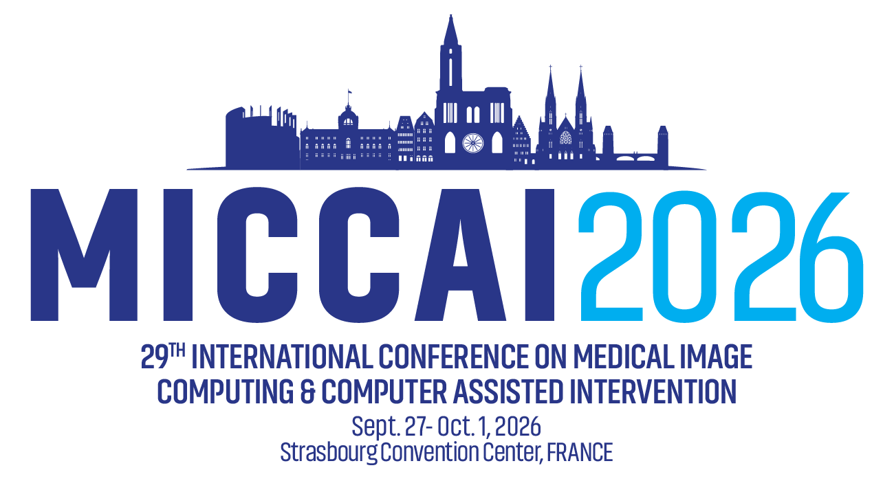
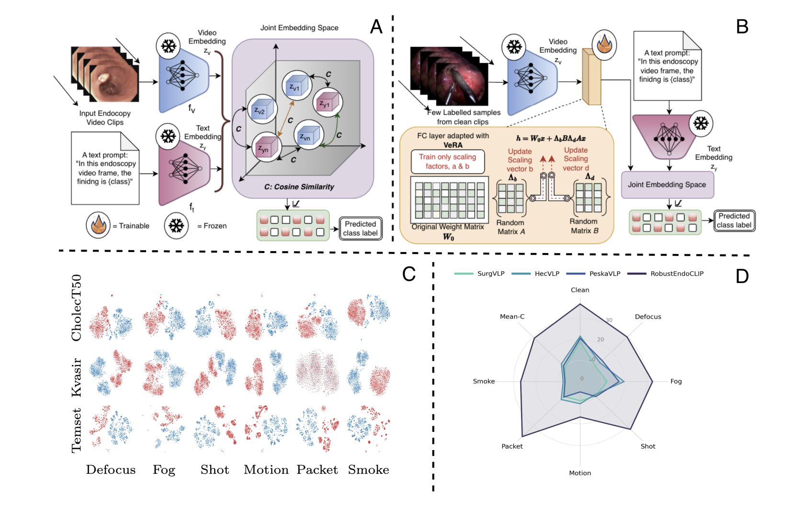

# On the Robustness of Temporal Vision-Language Models for Surgical Endoscopy Videos

Darakshan Rashid, Raza Imam, Ufaq Khan, Muhammad Bilal, Shazad Ashraf, Dwarikanath Mahapatra,
Mohammad Yaqub, Muhammad Haris Khan, Imran Razzak, Brejesh Lall, Lena Maier-Hein, Yutong Xie

IIT Delhi . MBZUAI .  Birmingham City University . University Hospitals Birmingham . Khalifa University . DKFZ

<p align="center">
  <strong>Accepted to MICCAI 2026</strong><br>
  <a href="https://conferences.miccai.org/2026/">
    
  </a>
</p>

[](https://arxiv.org/pdf/2608.14262) [](https://huggingface.co/piety/RobustEndoCLIP)

This repository provides the official implementation of our RobustEndoCLIP:

> On the Robustness of Temporal Vision-Language Models for Surgical Endoscopy Videos<br>
> Authors:<br>
> *Darakshan Rashid, Raza Imam, Ufaq Khan, Muhammad Bilal, Shazad Ashraf, Dwarikanath Mahapatra, Mohammad Yaqub, Muhammad Haris Khan, Imran Razzak, Brejesh Lall, Lena Maier-Hein, Yutong Xie*

<p align="center">
  
</p>
<p align="center">
</p>


For more details, please check out our [<ins>**paper**</ins>](https://arxiv.org/pdf/2608.14262).

## Abstract

Temporal vision-language models (TVLMs) offer a reusable, prompt-based interface for surgical video understanding, yet, their robustness under clinically realistic acquisition artifacts in endoscopy remains insufficiently characterized. In practice, degradations such as defocus, haze, motion blur, noise, cautery smoke, and packet loss introduce structured distribution shifts which may compromise video–text alignment. We study the robustness of temporal VLMs under such shifts caused by corruptions in clip frames. We introduce Endo-C6, a compact corruption benchmark of six endoscopy-realistic perturbations evaluated at a fixed high severity, and apply it to public Gastrointestinal (GI) endoscopy and laparoscopic cholecystectomy videos. Under a standardized prompt protocol, we benchmark 3 recent surgical TVLM baselines and analyze robustness in both mean and worst-case settings, spanning 294 dataset-level evaluations. Finally, we present RobustEndoCLIP, obtained by few-shot parameter-efficient tuning with VeRA, outperforming existing TVLM baselines. Our findings show that off-the-shelf TVLMs can exhibit severe worst-case collapse under endoscopy-specific corruptions, whereas lightweight few-shot adaptation can substantially improve corrupted performance and robustness without changing the prompt-based interface. We expect Endo-C6 to support standardized robustness reporting and promote more reliable clinical vision-language systems.

## Repository Layout

```text
RobustEndoCLIP/
├── README.md
├── REPRODUCE.md
├── requirements.txt
├── setup.py
├── surgvlp/                                  
│   ├── codes/
│   ├── surgvlp.py
│   └── mmcv.py
├── scripts/
│   ├── train_robustendoclip_vera.sh          
│   ├── train_robustendoclip_lora.sh          
│   ├── infer.sh                              
│   ├── aggregate_endo_c6_metrics.py          
│   ├── train_robustendoclip_vera.py          
│   ├── train_robustendoclip_lora.py          
│   ├── eval_cholect50_full_checkpoint.py     
│   ├── eval_kvasir_full_checkpoint.py
│   ├── eval_temset_full_checkpoint.py
│   ├── make_cholect50_percent_splits.py      
│   ├── make_kvasir_percent_splits.py
│   └── make_temset_percent_splits.py
├── tests/
│   ├── class_prompt.txt                      
│   ├── class_prompt_kvasir.txt
│   ├── class_prompt_temset.txt
│   ├── config_surgvlp.py                     
│   ├── config_hecvl.py                       
│   └── config_peskavlp.py                   
└── checkpoints/                             
```

## Prerequisites

### Hardware

This implementation is intended for a single-GPU setup. The paper's runs were evaluated on an
NVIDIA RTX A6000.

### Environment

```bash
conda create -n robustendoclip python=3.9 -y
conda activate robustendoclip
pip install -r requirements.txt
```

## Datasets

| Dataset | Domain | 
|---|---|
| CholecT50 | Laparoscopy | 
| Kvasir | GI endoscopy | 
| TEMSET-24K | Colorectal | 

The datasets are **not redistributed** here; obtain them from their official sources:

- [**CholecT50**](https://github.com/CAMMA-public/cholect50) 
- [**Kvasir**](https://datasets.simula.no/kvasir/) 
- [**TEMSET-24K**](https://zenodo.org/records/14016844)


**Endo-C6 corrupted-frame data** will be updated soon

## Checkpoints

**Base pretrained models** (SurgVLP, HecVL, PeskaVLP — the zero-shot baselines, and SurgVLP is also the starting point for training): download the weights from the [CAMMA SurgVLP repository](https://github.com/CAMMA-public/SurgVLP) and save them as `checkpoints/SurgVLP.pth`, `checkpoints/HecVL.pth`, `checkpoints/PeskaVLP.pth`.

Download the released RobustEndoCLIP checkpoints from Hugging Face:
**[piety/RobustEndoCLIP](https://huggingface.co/piety/RobustEndoCLIP)**

```bash
pip install -U huggingface_hub
hf download piety/RobustEndoCLIP --local-dir checkpoints
```


| Checkpoint | Budget | 
|---|---|
| `RobustEndoCLIP_VeRA_4pct.pth` | 4% | 
| `RobustEndoCLIP_VeRA_8pct.pth` | 8% | 
| `RobustEndoCLIP_VeRA_16pct.pth` | 16% | 
| `RobustEndoCLIP_LoRA_16pct.pth` | 16% | 

## Reproducing

Full required-environment-variable list, data layout, and training commands: **[REPRODUCE.md](REPRODUCE.md)**.


## Main Results

### Quantitative Results

**Table 1 — accuracy (%) on clean and Endo-C6 corrupted test data (16% label budget for RobustEndoCLIP).**
Mean-C is the average accuracy over the six corruptions, Worst-C is the lowest accuracy among them, and
Δ = Mean-C − Mean-C of SurgVLP.

<div align="center">

| Dataset | Model | Clean | Defocus | Fog | Shot | Motion | Packet | Smoke | Mean-C | Worst-C | Δ |
|---|---|---|---|---|---|---|---|---|---|---|---|
| CholecT50 | SurgVLP | 40.21 | 16.15 | 21.86 | 11.39 | 7.38 | 11.58 | 7.08 | 12.57 | 7.08 | 0.00 |
| | HecVLP | 44.41 | 18.96 | 32.54 | 17.09 | 12.78 | 17.44 | 7.30 | 17.69 | 7.30 | 5.12 |
| | PeskaVLP | 39.23 | 24.32 | 37.59 | 14.89 | 7.74 | 13.30 | 6.91 | 17.46 | 6.91 | 4.89 |
| | **RobustEndoCLIP** | 47.06 | 42.09 | 42.92 | 42.66 | 16.83 | 46.30 | 38.91 | **38.29** | **16.83** | **25.72** |
| Kvasir | SurgVLP | 13.75 | 9.50 | 12.25 | 12.80 | 14.75 | 14.08 | 10.91 | 12.38 | 9.50 | 0.00 |
| | HecVLP | 16.20 | 15.91 | 20.16 | 8.25 | 13.75 | 14.91 | 12.16 | 14.19 | 8.25 | 1.81 |
| | PeskaVLP | 16.20 | 14.83 | 12.08 | 12.25 | 6.50 | 15.08 | 11.08 | 11.97 | 6.50 | -0.41 |
| | **RobustEndoCLIP** | 36.50 | 18.83 | 26.17 | 26.08 | 13.50 | 37.17 | 11.42 | **22.20** | **11.42** | **9.82** |
| TEMSET-24K | SurgVLP | 2.82 | 4.24 | 2.23 | 5.17 | 5.10 | 4.35 | 2.07 | 3.86 | 2.07 | 0.00 |
| | HecVLP | 3.92 | 2.98 | 6.59 | 1.49 | 4.92 | 3.67 | 3.51 | 3.86 | 1.49 | 0.00 |
| | PeskaVLP | 5.78 | 2.98 | 2.87 | 2.88 | 0.40 | 2.86 | 2.56 | 2.43 | 0.40 | -1.43 |
| | **RobustEndoCLIP** | 26.67 | 28.67 | 28.59 | 27.14 | 19.98 | 27.05 | 29.92 | **26.89** | **19.98** | **23.03** |

</div>

RobustEndoCLIP improves Mean-C over the SurgVLP zero-shot baseline by **+25.72** (CholecT50),
**+9.82** (Kvasir), and **+23.03** (TEMSET-24K) points, using only 16% of each dataset's labels and
1,024 trainable parameters.

**Table 2 — RobustEndoCLIP-LoRA vs. RobustEndoCLIP-VeRA at a 16% label budget (Clean / Mean-C, %).**

<div align="center">

| Adaptation | # Params | Budget | CholecT50 | Kvasir | TEMSET-24K | Average |
|---|---|---|---|---|---|---|
| Zero-shot | 0 | 0 | 40.21 / 12.57 | 13.75 / 12.38 | 2.82 / 3.86 | 18.93 / 9.60 |
| RobustEndoCLIP-LoRA | 720,896 | 16% | 54.18 / 18.31 | 15.92 / 14.29 | 29.48 / 18.17 | 33.19 / 16.92 |
| **RobustEndoCLIP-VeRA** | **1,024** | 16% | 47.06 / 38.29 | 36.50 / 22.20 | 26.67 / 26.89 | 36.74 / **29.13** |

</div>

RobustEndoCLIP-VeRA reaches a higher average Mean-C than RobustEndoCLIP-LoRA (**29.13** vs 16.92)
*and* a higher average clean accuracy (36.74 vs 33.19), with **~700× fewer** trainable parameters
(1,024 vs 720,896). Per dataset, LoRA has higher clean accuracy on CholecT50 and TEMSET-24K.

## Citation

```bibtex
@article{rashid2026robustness,
  title={On the Robustness of Temporal Vision-Language Models for Surgical Endoscopy Videos},
  author={Rashid, Darakshan and Imam, Raza and Khan, Ufaq and Bilal, Muhammad and Ashraf, Shazad and Mahapatra, Dwarikanath and Yaqub, Mohammad and Khan, Muhammad Haris and Razzak, Imran and Lall, Brejesh and others},
  journal={arXiv preprint arXiv:2608.14262},
  year={2026}
}
```


## Acknowledgements

We thank the CAMMA group, University of Strasbourg, for releasing SurgVLP, HecVL, and PeskaVLP —
[CAMMA-public/SurgVLP](https://github.com/CAMMA-public/SurgVLP), on whose code this work builds.

We also thank the creators and maintainers of the CholecT50, Kvasir, and
TEMSET-24K datasets for making their data available to the research community.

## License

Released for non-commercial research use under **[CC BY-NC-SA 4.0](LICENSE)**. See
[`LICENSE`](LICENSE) for the full terms.

## Contact

For any query contact: Darakshan Rashid —
[bsz228540@iitd.ac.in](mailto:bsz228540@iitd.ac.in) /
[darakshanrashid20@gmail.com](mailto:darakshanrashid20@gmail.com)
